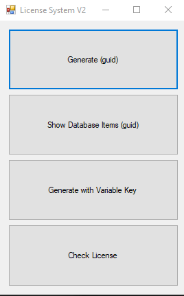
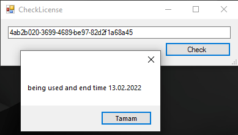
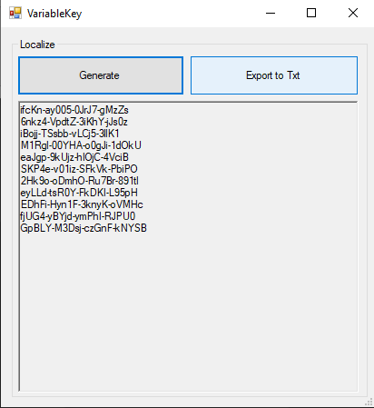
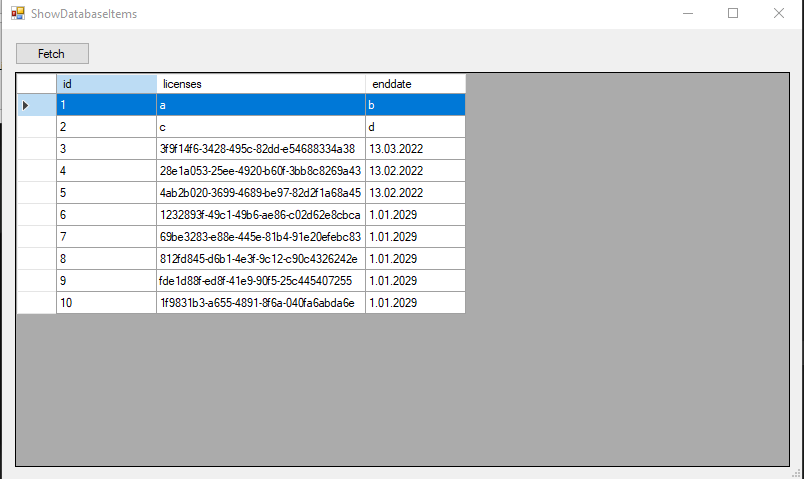
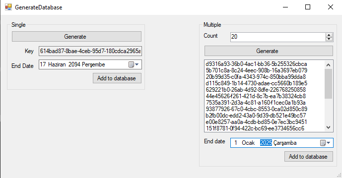

# license-system-v2
C# MySQL License System V2

v1
I made a simple licensing system on my own scale. I used MySQL and C # to show you how you can generate a license key and compare it with the database. You can further develop it if you want.

v2
In this project, we added key generation with 5 to 4 variable, as an extra, we added the license expiry date.

Visual Studio MySql Conenctor : https://cdn.mysql.com//Downloads/Connector-Net/mysql-connector-net-8.0.28.msi
MySql Xampp : https://www.apachefriends.org/tr/download.html
4.8 : https://dotnet.microsoft.com/download/dotnet-framework/net48

